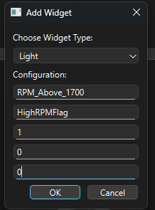

# Driver Dashboard

A data visualization tool, create to be configurable for each engineer's unique use-case. Project started by Noah Hickman.


This repo is starter information and code for the driver dashboard project. The goal of the project is to allow signal-based .mf4 data to be shown on a live dashboard screen, viewable for the driver, and able to be configured specific to each driver and their signal viewing needs. This is done by parsing signal-based .mf4 files, transmitting them to the display microcontroller via UDP transmission, and then building a custom Python GUI to show the data updates in real time.

## frametosignalmf4.py
This Python script is specifically made to take the frame-based .mf4s we have now and turn them into signal-based .mf4s using our .dbc files. We do this by using the asammdf and cantools libraries.

### Code Breakdown
First, we load the .mdf file we want to convert as well as the .dbc that matches it, grabbing any signal objects we can from the .mf4. Specifically, you'll need a group number, which corresponds to what type of data is on the .mf4. Group 1 is Vector bit logging data, group 4-5 is ethernet data, and the rest should be CAN data. 
```python
    from asammdf import MDF

    mdf = MDF("ZZ5420_Data2_F019_2025-07-24_23-39-58.MF4")
    for i, group in enumerate(mdf.groups):
        print(f"Group {i} attributes: {dir(group)}")
        print(f"  channels: {[ch.name for ch in group.channels]}")
        print("---")
```
You can use the above code to check what groups each .mf4 has if need be.
Next, we build an initial list of frames, putting together the CAN IDs, data length code, and data bytes into a single tuple, to create a list of frame tuples.
We then decode these frame tuples by using the .dbc file we loaded in with cantools, appending them to a decoded signals list, with timestamp and signal data tuples.
Since we now have a bunch of frames set with their respective signal name, we now need to order them by their signal, so we can make an accurate time series. We make a default dictionary to prevent any key errors from popping up, and we slowly built our dictionary of signals as we go through each frame we have decoded.
Lastly, we convert everything into asammdf Signal objects, making sure we have float values for the .mf4, and then we finally build the signal-based .mf4 file.

### How to use
In order to use the file, you only need to change 3 lines of code.
```python
  mdf = MDF("ZZ5420_Data2_F019_2025-07-24_23-39-58.mf4")
  db = cantools.database.load_file("CHASSIS_667kB_dbc_2024_20a.dbc")
 #---------------------------------------------------------------------
  new_mdf.save('signal_based_output_group3.mf4')# generate a signal-based output file
```
You'll change the file paths of the files you are accessing and then the file you want to create when the script outputs your signal based .mf4.

## signalmf4_udpsender.py 
This is a really simple script that you can use to send your signal .mf4 values from your logging system to your dashboard system. 

### How to use
You'll simply load in whatever .mf4 file you need with this line:
```python
    mdf = MDF("signal_based_output_group6.mf4")
```
Next, the code will get whatever you channel you want, and store all the values for it.
The code then points to a network address and port (this will be your receiver's address and port).
And then with a for loop, the signal and value are stored in a json-type dictionary, and then the message is sent.

To add more signals, just simply change these lines:
```python
    OilTemp_data = mdf.get("EngOilTemp_Cval")
    #---------------------------------------
    oiltempvalues = OilTemp_data.samples
```

Disclaimer: Right now, this ignores timestamps, purely because the signal-based .mf4s I was using were already organized by timestamp, so the signal values would always line up. If this is not the case for your .mf4s you will need to extract the timestamps and order the signal values yourself.

## dashboard_templates.py
This is the basis file for the driver dashboard project. It includes not only preset, configurable widgets, that can be called as a new class instance, the data receiver class for receiving UDP files, etc. You will need to import this into the actual running code for the driver dashboard to referene the class structures that you need. The driver interface works primarily with the PyQt library to make configurable interfaces.

### Code Breakdown
Currently, the first three classes, Light, Tickbar, and Gauge, are all the class structures for making PyQt widgets. These classes take in variables to configure each widget for whatever signal you need it to display.
The next class is the DataReceiver class, that when called will allow us to read the incoming data from the UDP packets, process them, and get ready to assign those to there respective widgets.
The AddToWindow class, sets up the actual widgets that you want to add to the window. This will create an instance of the specified widget class, a remove button for the widget, and place it into a widget container to be shown on the dashboard window. Each created dashboard widget will also be logged in a dictionary called all widgets (which is setup in the actual running code file), so that the code can have a failsafe way of tracking what widget are there. 

The class does this by first, using the new_widget function, that creates the dashboard widget and the remove button into a layout container. And then the remove_widget function removes the container layout if the remove button is clicked and also uses a callback function to add back the add widget button so that the user can create and remove widgets at will.
### How to use
You'll use this file like this:
```python
    from dashboard_templates import DataReceiver, AddToWindow
```
You'll import it into your actual window running script (either your own code or based off the template I'll go over later).

Additionally, if you are wanting to make your own custom widget, but still want to use the networking capabilities/widget creation features of the rest of the code, you'd need to make a new class for that widget, draw it out however you'd like, and then make sure it has a set_value function to allow it to change as data comes in. There are a bunch of different templates and examples of graphics you can use online, knock yourself out, and use the three examples I have to set up the rest of the code you need.

## examplewindow_v2.py
This script is the basis of the actual running file you would use to run your dashboard. Please use the V2 version, the original is now in the legacy folder and is outdated (does not work with the current version of the dashboard_templates.py file)

### Code Breakdown
You have 3 main classes inside this file. 
    - AddWidgetDialog, which includes all the prompts, dropdowns, and buttons in the add widget popup window.
    - SlotWidget, which includes all the add widget buttons on the initial dashboard screen
    - and lastly, Window, which includes the code to intialize the window itself, and also route incoming signals to update the widgets as new data comes in

AddWidgetDialog has a bunch of defined textboxes and popup features, as well as the getData function, that gets the user inputs from the popup. It's a fairly self-explanatory class. 

SlotWidget is more complicated, by first calling on the parent_layout of the main dashboard (to fit the add buttons into the grid layout of the main dashboard), and intializes with creating the add button in each slot (the slots are defined in the Window class). We also have the openAddDialog function, that when the add button is pressed, the popup window instance is actually created by calling the AddWidgetDialog class, and then based on the user input, the new widget gets shown on the dashboard by calling the next function, widget_row. Also, by doing self.layout.addLayout(), whatever is output by widget_row() gets automatically shown in the self.layout of SlotWidget, which is tied to the parent_layout of the main window (so tldr, its a long chain that ends in the newly created widget actually being shown on the window).
Widget_row just simply calls an instance of the AddToWindow class in the dashboard_templates.py file, creates the widget and remove button, and then places it in a layout container that is returned and can be placed into a larger layout. Also, it makes sure that AddToWindow has a callback function, so that if the remove button that was created with the widget_row function is actually clicked, it can be called back to remove its widgets and put back the add widget button. That is the purpose of the last function, restore_add_button.

Window is the last class, and the parent class of this file. It essentially creates the main dashboard window, creates the first add button instances, based on a 3x2 grid pattern (adjust this how you want, but also make sure the widget sizes fit into that layout, along with the window size itself). Then, it also calls an instance of data receiver from dashboard_templates.py, so that it can recieve UDP files and update the widgets as needed. This is done by using the route_signal function inside the Window class, which routes the UDP data coming in to its corresponding widget, based in signal name (each widget has a specfic signal name tied to it and the UDP data should be formatted in JSON dictionary notation, so that you can simply call what ever signal you need by key name.


### How to use
To see the example of how the dashboard works, simply run the file, and interact with the UI. 
You can use this file as a basis for the expansion of the project as well, since most of the other code was based off of this anyways.


## Looking at the actual UI itself





